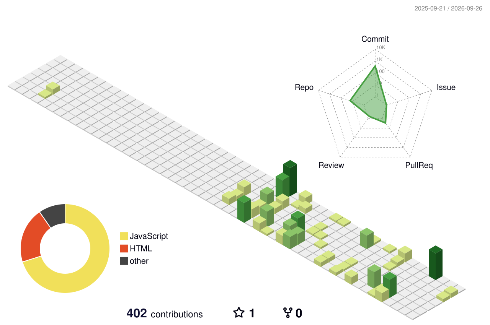

<div align="center" width="100%">
<div align="center">

<!-- ANIMATED HEADER BANNER -->


<!-- TYPING ANIMATION -->
[](https://git.io/typing-svg)

<br/>

<!-- PROFILE VIEWS -->
[](https://github.com/Chiragmohite)

</div>


## 🧠 About Me

```python
class Chirag:
    def __init__(self):
        self.username   = "Chiragmohite"
        self.focus      = ["AI / ML", "Machine Learning", "Deep Learning"]
        self.languages  = ["Python", "JavaScript", "Java", "SQL"]
        self.currently  = "Building AI projects 🚀"

    def say_hi(self):
        print("Thanks for stopping by! Let's build something cool.")

Chirag().say_hi()
```


## 🛠️ Tech Stack

<div align="center">

| # | Category | Icons |
|---|---|---|
| 🔤 | **Languages** |     |
| 🤖 | **AI / ML** |     |
| ⚙️ | **Frameworks** |   |
| 🧰 | **Tools** |   |

</div>


## 🚧 Currently Building

- 🧁🐶 **Muffin vs Chihuahua Classifier** — a binary image classifier built for a hackathon's Kaggle competition, currently in the online round; uses 3LC for dataset labeling with a `train.py` / `predict.py` workflow and test-time augmentation.
- 🏦🔒 **SecureLend** — an AI-powered NBFC loan platform with a hybrid intrusion detection system, blending fintech, cybersecurity, and agentic AI, built via Emergent AI.


## 📊 GitHub Stats

<div align="center">


&nbsp;


<br/>

[](https://git.io/streak-stats)

</div>


## 📈 Contribution Graph

<div align="center">

[](https://github.com/Chiragmohite)

</div>


## 🌆 3D Contribution Map

<div align="center">

<picture>
    <source media="(prefers-color-scheme: dark)" srcset="./profile-3d-contrib/profile-night-green.svg" />
    
</picture>

</div>


## 👾 Pac-Man Contributions

<picture>
    <source media="(prefers-color-scheme: dark)" srcset="https://raw.githubusercontent.com/Chiragmohite/Chiragmohite/output-pacman/pacman-contribution-graph-dark.svg">
    <source media="(prefers-color-scheme: light)" srcset="https://raw.githubusercontent.com/Chiragmohite/Chiragmohite/output-pacman/pacman-contribution-graph.svg">
    
</picture>


## 📝 Quote

<div align="center">

</div>


## 🤝 Connect With Me

<div align="center">

[](https://www.linkedin.com/in/chirag-mohite-971949290)
[](mailto:chiragmohite02@gmail.com)
[](https://github.com/Chiragmohite)

</div>


<div align="center">

<!-- FOOTER WAVE -->


**⭐ Star some repos if you like my work!**

</div>

</div>
